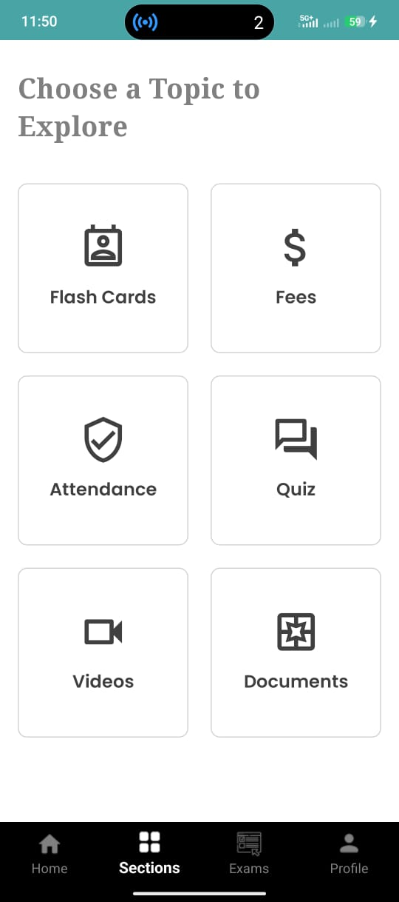
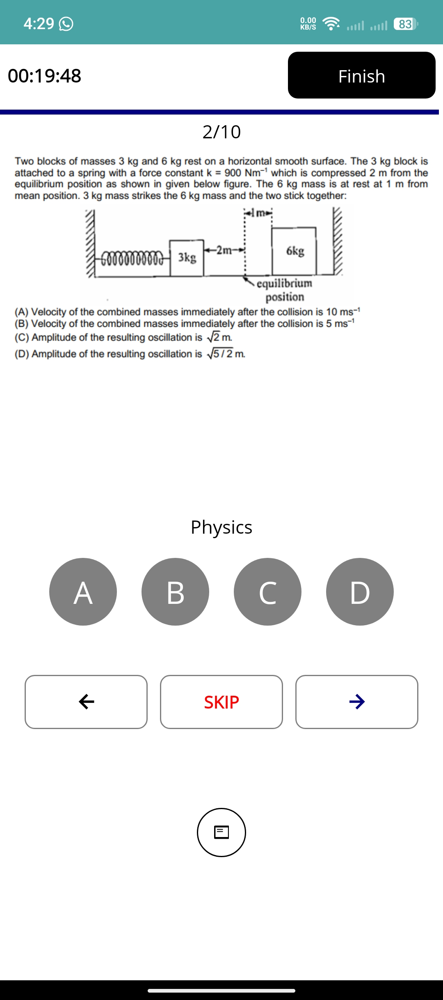
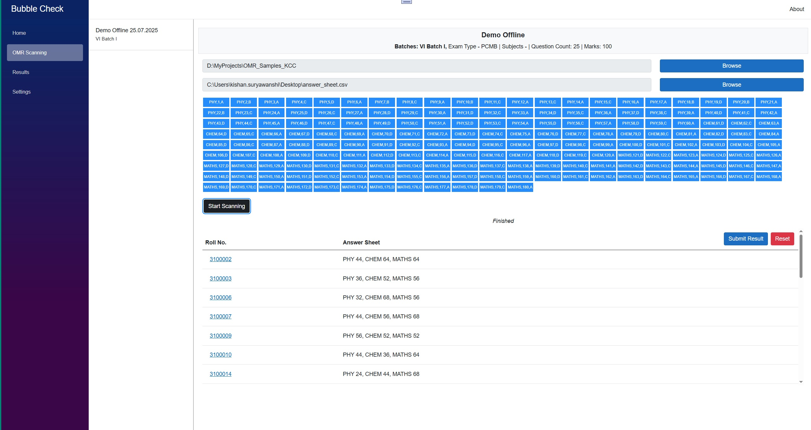
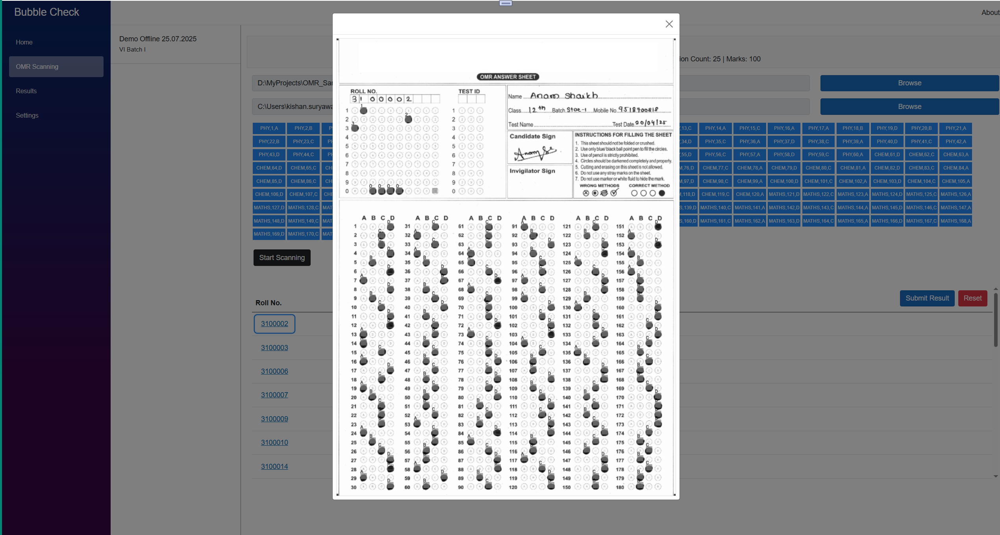
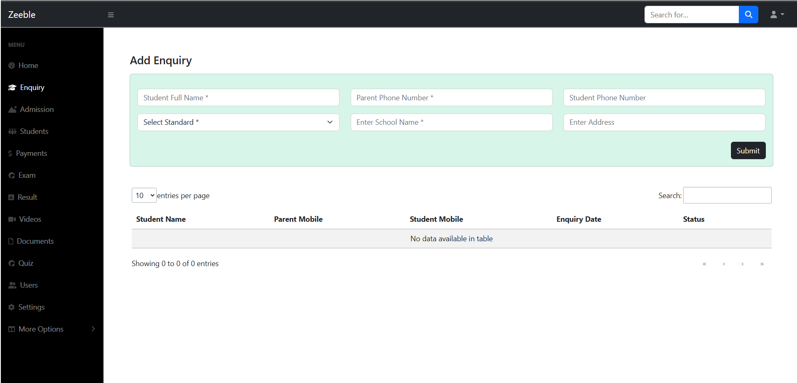

# Zeeble

A management system for private classes — designed for private tutions from class 7th to IIT JEE / NEET  and other coaching classes.

## 🎯 What is Zeeble

Zeeble is a private class management platform that helps manage students, classes, quizzes, results, and related workflows. It consists of modular components handling backend API, admin UI, quizzes, class tests, data libraries, and more — making it suitable for coaching institutes or private tutors aiming to organise courses, track students, and manage assessments.




## 🎯 BubbleCheck 
.NET MAUI Cross Platofrm desktop application to scan the OMR anwer sheets.





## 🧰 Project Structure

The repository is organised into multiple sub‑projects/modules:

* **Zeeble.Api** — Backend API
* **Zeeble.Web.Admin** — Admin interface / management dashboard
* **Zeeble.Shared** — Data access / models / data handling
* **Zeeble.BubbleCheck** — OMR Sheet Scanner desktop application.
* **Zeeble.Mobile** — Student application for Class test, document sharing, video stream, fee payments.
* Solution file: `Zeeble.sln` — root solution for building the entire system




## ✅ Features

* Student / class management — maintain records of students, class groups, etc.
* Quiz & test management — create, schedule, and manage quizzes/tests for classes.
* Admin dashboard — manage classes, students, enrollments, assessments.
* Modular architecture — separation of API, UI, data layers for maintainability and extensibility.
* Multi-module solution — easier to extend with new features (e.g. reports, analytics, attendance, payment, etc.).

## 🚀 Getting Started / Installation

### Prerequisites

* [.NET SDK / runtime version you target] (e.g. .NET 6 / .NET 7)
* A compatible database (SQL Server, SQLite, PostgreSQL, etc.)
* (Optional) Web server / hosting if deploying the web frontend/backend

### Local Setup

```bash
# Clone the repo
git clone https://github.com/eullora/tution.git
cd zeeble

# Open solution in your IDE (e.g. Visual Studio, VS Code with C# plugin)
# Build the solution
# Update configuration / connection strings / environment variables as needed
# Run the API and Web / Admin modules
```

### Running / Usage

1. Start `Zeeble.Api` — backend server
2. Launch `Zeeble.Web` or `Zeeble.Admin` in browser
3. (Optional) Create admin user, set up initial data, create classes/students, etc.

## 🧑‍💻 Contributing

Contributions are welcome! If you want to contribute:

* Fork the repository
* Create a new branch with a descriptive name (e.g. `feature/attendance-module`)
* Make changes / add tests / update docs
* Submit a pull request

Please ensure:

* Code compiles cleanly without errors
* Follow the existing project structure / coding conventions
* Update or add documentation (where relevant)

For major changes (e.g., architecture, DB schema), please open an issue first to discuss.

## 📄 License

Please include a license file (`LICENSE`) if you wish to open-source the project. Otherwise, specify licensing terms here.

## 🛠️ Roadmap / Future Work / TODOs

* Payment / fees management
* Report generation (performance, attendance, analytics)
* Notification / email / WhatsApp integration

## 🤝 Acknowledgments / Credits

If you referenced any tutorials, libraries, or were inspired by other projects — credit them here.
